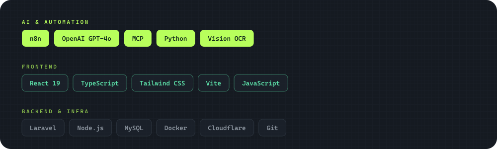

  
  
  
  

I build AI pipelines that read Arabic invoices and documents — and the React interfaces people use on top of them. In production, timed with Saudi Arabia's **ZATCA** e-invoicing expansion.

Al Khobar, Saudi Arabia. Arabic and English.

### Building right now

- **MCP servers** — real data and profiles exposed as callable tools for AI models
- **GPT-4o Vision extraction** for Arabic invoices, running in production
- **LLM cost routing** — cut one pipeline's GPT bill by 75% with a single IF node
- **React 19 + TypeScript** interfaces on top of all of it

### Ask me about

- Getting an LLM to read Arabic documents reliably. The model is not the hard part.
- n8n in production: retries, idempotency, cost control, and when to stop using it
- Structuring a React 19 + TypeScript codebase a team can maintain
- Running a small engineering team while still writing code

### Featured work

| Project | What it is | Stack |
| :--- | :--- | :--- |
| **Receipt Scanner** | Bilingual (AR/EN) AI invoice-management SaaS. Photo → approved, structured data. Fraud checks, zero manual entry. | `n8n` `GPT-4o Vision` `React 19` `Laravel` |
| **Business Card Extractor** | Photo → AI → structured contact → saved to your phone in one tap. No backend. | `React` `n8n` |
| **MCP Servers** | Real data and profiles exposed as callable tools for AI models. | `MCP` `Node.js` |
| **[GoldenTag](https://play.google.com/store/apps/details?id=com.leadbridge.golden_tag)** | Jewelry store management app — inventory, barcode scanning, live FX rates, sales logging. | `Play Store` `Delivery` |
| **[Portfolio Gallery](https://nourtofi.github.io/portfolio-gallery/)** | 20 distinct award-tier web designs. | `Three.js` `Canvas` `CSS` |

> Receipt Scanner live demo on request — [DM me on LinkedIn](https://www.linkedin.com/in/nouraldeentofi).

### The website experiment

My portfolio is built for humans **and** AI agents. Every fact on it is machine-readable.

[`nouraldeentofi.com`](https://nouraldeentofi.com) &nbsp;·&nbsp; [`/llms.txt`](https://nouraldeentofi.com/llms.txt) &nbsp;·&nbsp; [`/api/profile.json`](https://nouraldeentofi.com/api/profile.json) &nbsp;·&nbsp; [`/mcp`](https://nouraldeentofi.com/mcp/README.md)

Ask ChatGPT or Claude *"Who is Nour Aldeen Tofi?"* and see what happens.

### Stack

Laravel backend work with [Haitham Zedan](https://www.linkedin.com/in/haitham-zedan-391668221/).

### Contribution activity

  

<b>Open to senior frontend, AI automation, and consulting work across the Gulf.</b>

